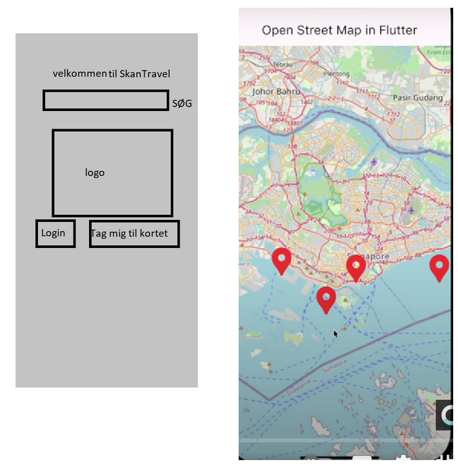

# Kravspecifikation

## App

En login- og registeringsskærm implementeres. De kalder op mod backenden. Når logget ind, får brugeren en token som bruges i fremtidige API-kald.

Der skal være en brugerprofil-side hvor man kan se og ændre profilbillede, land, email. Man skal også kunne se liste over favoritter og anmeldelser.

Et kort embeddes ind i appen vha. OSM/Google Maps. Her henter appen en liste over anmeldelser fra alle brugere samt brugerens egne favoritsteder fra backenden og viser dem på kortet.

Der er en knap til at tilføje en anmeldelse. Denne åbner en ny skærm eller popup, hvor brugeren kan vælge antal stjerner samt uploade evt. billeder. Når denne anmeldelse er indsendt, bliver den vist for de andre brugere ved personens nuværende lokation.

Der er en knap til at tilføje favorit. Enten nuværende lokation bruges, eller der klikkes et sted på kortet. Koordinaterne bliver sendt til backenden.

Vi har tænkt os at lave en sidebar som menu hvor man kan logge ind. Den menu skal også blive brugt til at navigere hen til en liste over brugerens favorit aktiviteter og yndlingssteder.

Homepage kommer til at være mappet hvor du også får en chan

## Database

users: id, username, password, email, profile_image_id, created_at, updated_at

sessions: id, user_id, token, expires_at

favorites: id, user_id, lat, lng

images: id, user_id, image_path

reviews: id, user_id, lat, lng, rating

review_images: review_id, image_id

## API

POST /users/create

POST /users/login

PUT /user

POST /favorites

GET /favorites

DELETE/favourites

POST /reviews

GET /reviews

GET /activities

Logoet et sted på den grå skærm. De 2 firkanter skal merges(Kunne bare ikke lave det i paint) mockup kan ændres

"Vi vil udvikle en TuristApp for SkanTravles, som gør brug af telefonens sensorer. Vores mål er at skabe en applikation, der viser et kort eller bruge en søgefunktion til at finde interessante steder og aktiviteter rundt i verden, ved at integrere funktionalitet, der udnytter data indsamlet fra telefonens sensorer.

For at opnå dette, tænker vi at anvende følgende Teknologier:

- Flutter til selve appen (Frontend)

- ASP.NET Core Web Api (Backend)

- Entity Framework (Backend to Database Tool)

- SQL database (Database)

Appen vil kunne Bruge Web API’en til at snakke sammen med brugerdata, samt en extern API til at få fat i Aktuelt data fra verdenen der skal ind i kortet, ved at gøre brug af sensorer som GeoLokation for at finde brugerens præcise lokation.

Vores applikation vil have følgende funktioner:

- Brugeroprettelse: Brugerne skal kunne oprette profiler med, brugernavn, adgangskode, profilbillede, land, navn og mail samt

Brugeren ville også have mulighed for at lave anmeldelser og favoritte aktiviteter og steder i verden.

- Sensorintegration: Appen vil bruge GeoLokation for at finde brugeren præcise lokation som vi kan bruge til at vise steder og aktiviteter i nærheden.

Brugeren vil have mulighed for at selv bestemme hvor stor en radius af aktiviteter og steder der skal vises rundt om dem.

- SideBAR: En interaktivt sidebar, man kan bruge til at logge ind og ud fra, og se ens egne favorit steder og aktiviteter.

- SøgeFelt: Et søgefelt til at finde andre aktiviteter og steder i verden der ikke er rundt omkring brugeren

- TuristGuides: Der ville blive anbefalet turistguides til det valgte område man sidder og kigger på.

- Kunden vil blive involveret i projektarbejdet med regelmæssige møder for at sikre, at vi opfylder deres behov og forventninger. Vi vil også overveje at integrere ekstra funktioner som en fin homepage og favorit af turistguides afhængig af projektets fremdrift og tidsplan.

Dette projekt vil give os praktisk erfaring med de overstående teknologier, og give os mulighed for at udforske, hvordan teknologi kan anvendes til at løse reelle problemer eller forbedre dagligdagen."

